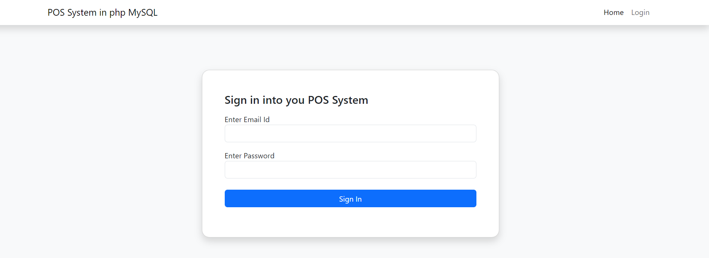

# Point of Sales in php

Created a POS system in PHP with a streamlined dashboard for efficient billing and order management.

## Features

- Billing Dashboard: A centralized interface for generating and managing customer bills.
- Order Management: Streamlined order processing, allowing users to track and update orders efficiently.
- Real-time Data Updates: Instant updates for transactions and orders to ensure accuracy.
- User-friendly Interface: An intuitive design that simplifies navigation and reduces operational errors.

## 🛠 Skills
React, HTML, CSS...

## Screenshots

## Used By

This POS system is used by the following Hotels:

- Hotel Mohole Wada

